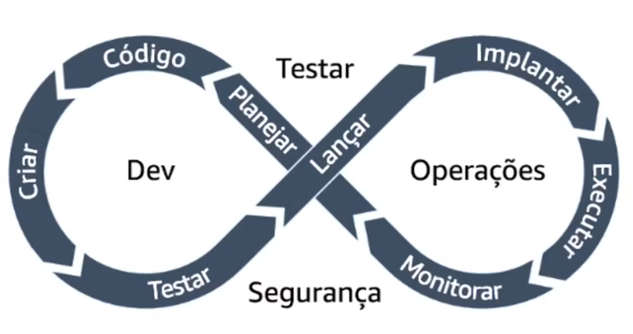

# Introdução à DevOps

## O que é DevOps?

DevOps é uma abordagem que combina filosofias culturais, práticas e ferramentas para melhorar a capacidade das empresas de distribuir aplicativos e serviços de forma rápida e eficiente. Essa metodologia visa otimizar e aprimorar produtos em um ritmo mais acelerado do que os métodos tradicionais de desenvolvimento de software e gerenciamento de infraestrutura, permitindo que as empresas atendam melhor aos seus clientes e sejam mais competitivas no mercado.

Para mais informações, visite [a página oficial da AWS sobre DevOps](https://aws.amazon.com/pt/devops/what-is-devops/).

## Metodologia Agile

A metodologia Agile é uma abordagem de desenvolvimento de software que prioriza a entrega contínua de valor ao cliente, adaptando-se a mudanças e respondendo rapidamente aos requisitos em evolução. É uma parte fundamental da cultura DevOps, permitindo que equipes entreguem software de alta qualidade de forma mais rápida e eficiente.

## Definição de Pipeline ou Ciclo de Vida

Um pipeline de entrega é uma série de passos automatizados que permitem a entrega contínua de software, desde a integração de código até a implantação em produção. Ele descreve o processo pelo qual o código fonte é compilado, testado e implantado em ambientes de produção ou de teste. 

## Ambientes de Software

Ambientes de software são conjuntos de infraestrutura e configuração que suportam o desenvolvimento, teste e implantação de software. Eles podem incluir ambientes de desenvolvimento, teste, homologação e produção, cada um com suas próprias configurações e requisitos.

## Automação de Infraestrutura e Contêineres

A automação de infraestrutura é o processo de gerenciar e provisionar recursos de computação de forma automatizada, utilizando ferramentas e scripts para configurar e implantar servidores, redes e outros componentes de infraestrutura. Contêineres são uma tecnologia que permite empacotar e executar aplicativos de forma isolada, garantindo consistência e portabilidade entre diferentes ambientes.

## Certificado de Conclusão do Módulo 1 da trilha DevOps

Este certificado reconhece a conclusão bem-sucedida do primeiro módulo do curso de DevOps, comprovando as habilidades e conhecimentos adquiridos na área. É uma validação do compromisso com a excelência em práticas DevOps e aprimoramento contínuo no campo da engenharia de software.

