# Introdução à Redes

## Redes, Computadores e Tipos de Redes

Uma rede de computadores é um conjunto de dispositivos interconectados que podem compartilhar recursos e informações. Existem diferentes tipos de redes, incluindo LAN (Rede Local), WAN (Rede de Área Ampla) e MAN (Rede Metropolitana), cada uma com suas próprias características e alcances.

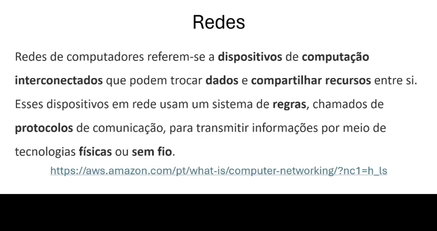
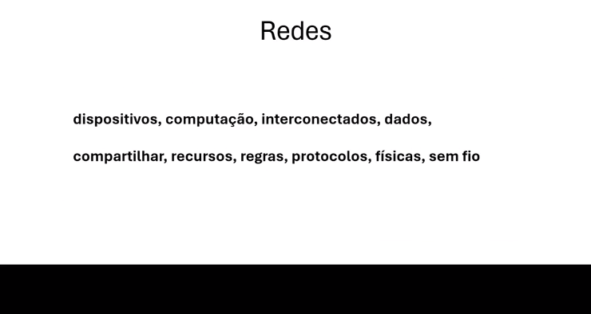
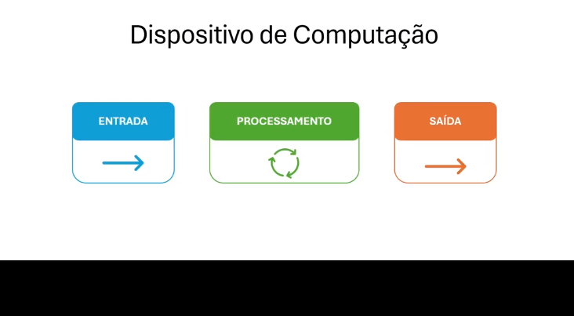
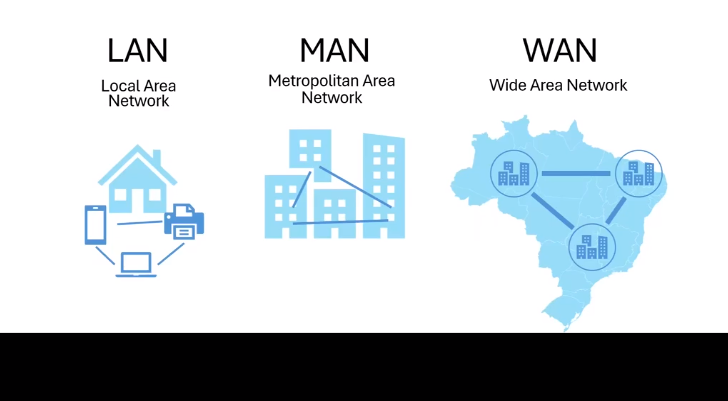

## Dispositivos de Rede

Os dispositivos de rede são equipamentos usados para conectar e comunicar dispositivos em uma rede. Alguns exemplos incluem switches, roteadores, hubs, bridges, entre outros.

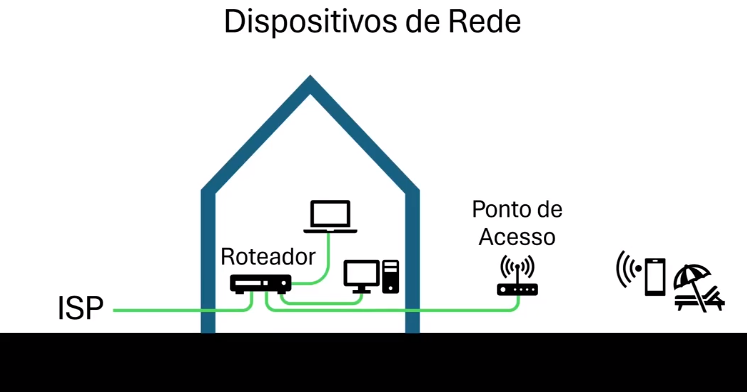
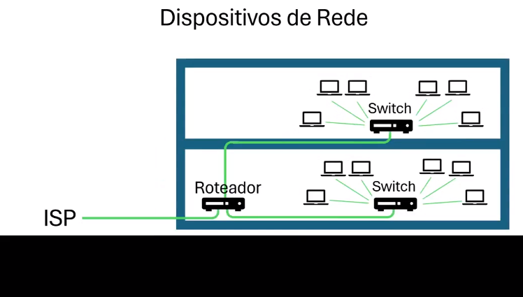

## Endereçamento IP

O endereçamento IP é um sistema para atribuir identificadores únicos a cada dispositivo em uma rede. Existem dois principais protocolos de endereçamento IP: IPv4 e IPv6.

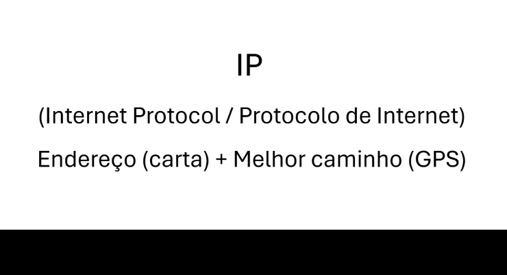

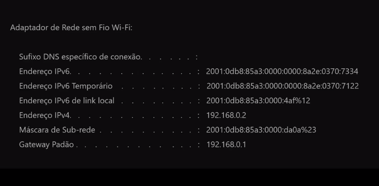
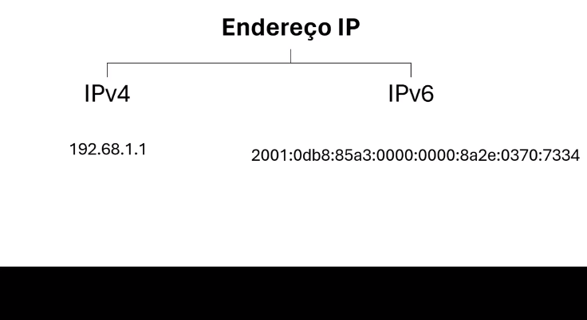
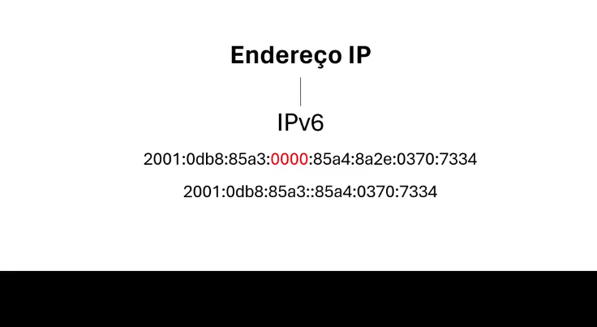

## Whois, MAC e NAT

Whois é um serviço de pesquisa que fornece informações sobre registros de nomes de domínio, como o proprietário do domínio e informações de contato. MAC (Media Access Control) é um identificador exclusivo atribuído a dispositivos de rede para comunicação em uma rede local. NAT (Network Address Translation) é uma técnica que permite que vários dispositivos em uma rede compartilhem um único endereço IP externo.

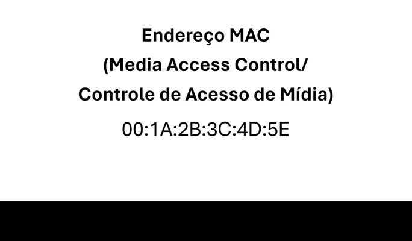

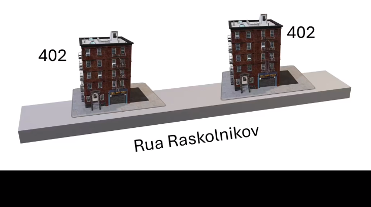
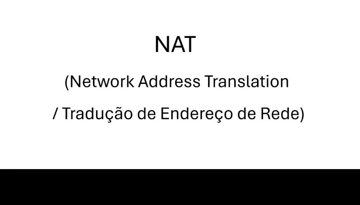

## Unicast, Broadcast e Multicast

Unicast é uma comunicação de um ponto para outro em uma rede.

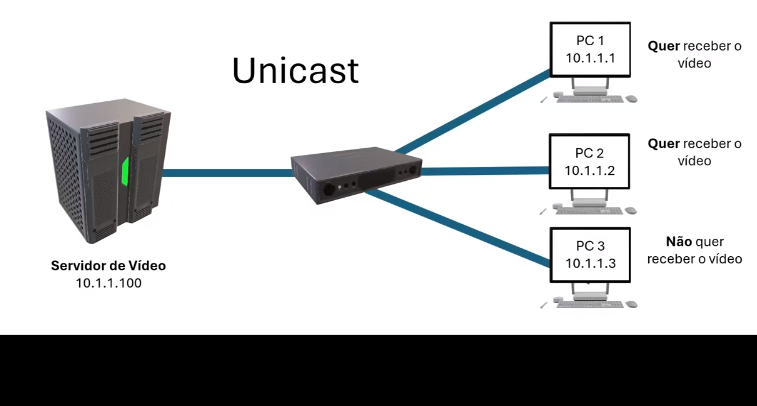

Broadcast é uma comunicação de um ponto para todos os dispositivos em uma rede.

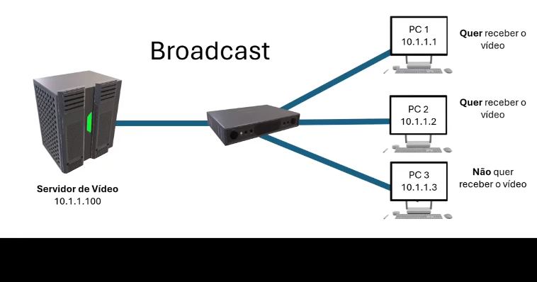

Multicast é uma comunicação de um ponto para vários dispositivos em uma rede.

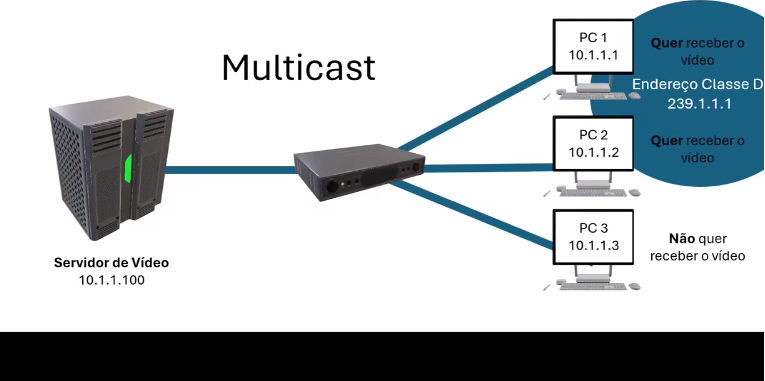

## Roteamento, VLAN e Firewall

Roteamento é o processo de encaminhamento de dados entre redes. VLAN (Virtual Local Area Network) é uma rede lógica que agrupa dispositivos em diferentes segmentos de rede, independentemente da sua localização física. Firewall é um dispositivo ou software que controla o tráfego de rede, permitindo ou bloqueando determinadas comunicações com base em regras de segurança.

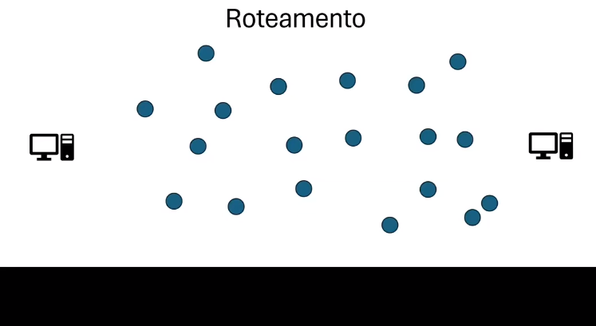
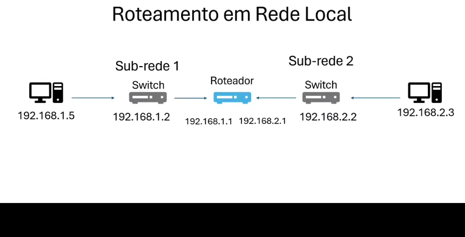
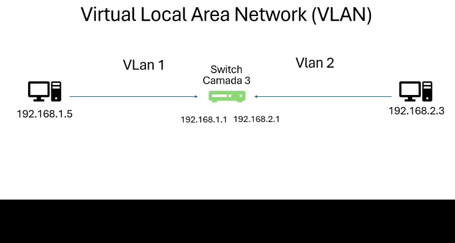
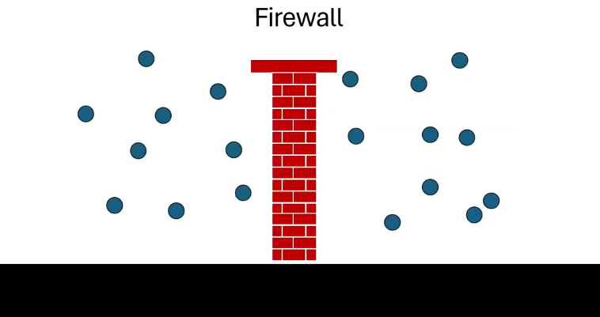

## IPs Públicos e Privados

IPs públicos são endereços IP únicos atribuídos a dispositivos na Internet, enquanto IPs privados são usados em redes locais e não são acessíveis diretamente da Internet.

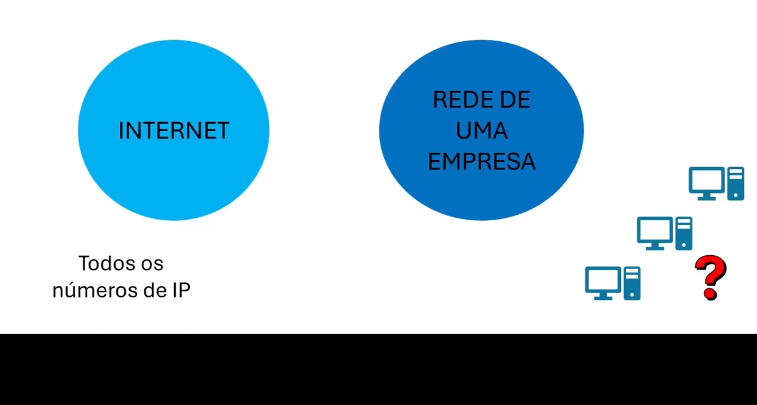
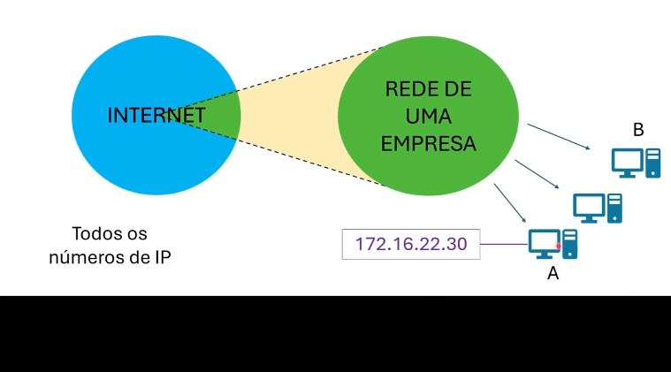
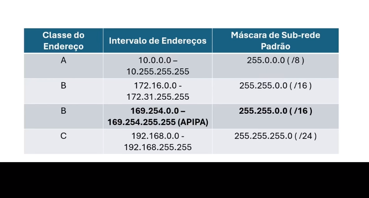

## VPN, DNS e DHCP

VPN (Virtual Private Network) é uma rede privada virtual que permite que usuários remotos se conectem a uma rede privada de forma segura pela Internet. DNS (Domain Name System) é um sistema que traduz nomes de domínio em endereços IP. DHCP (Dynamic Host Configuration Protocol) é um protocolo que atribui automaticamente endereços IP e outras configurações de rede a dispositivos em uma rede.

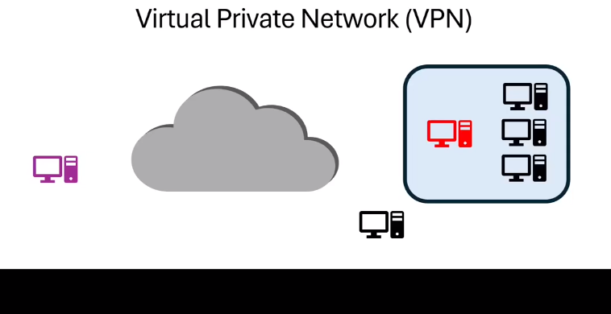
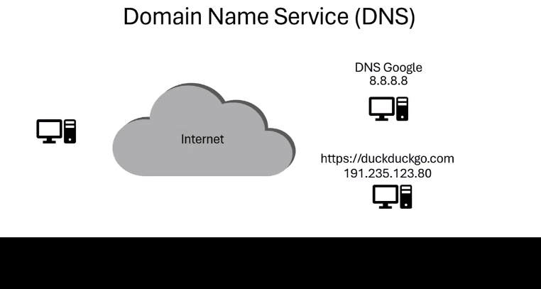
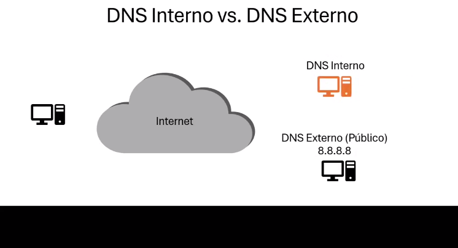
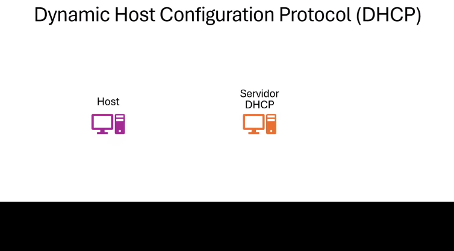