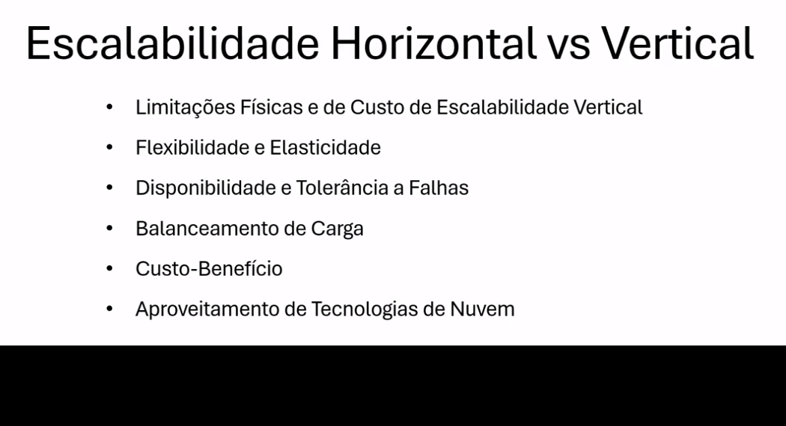
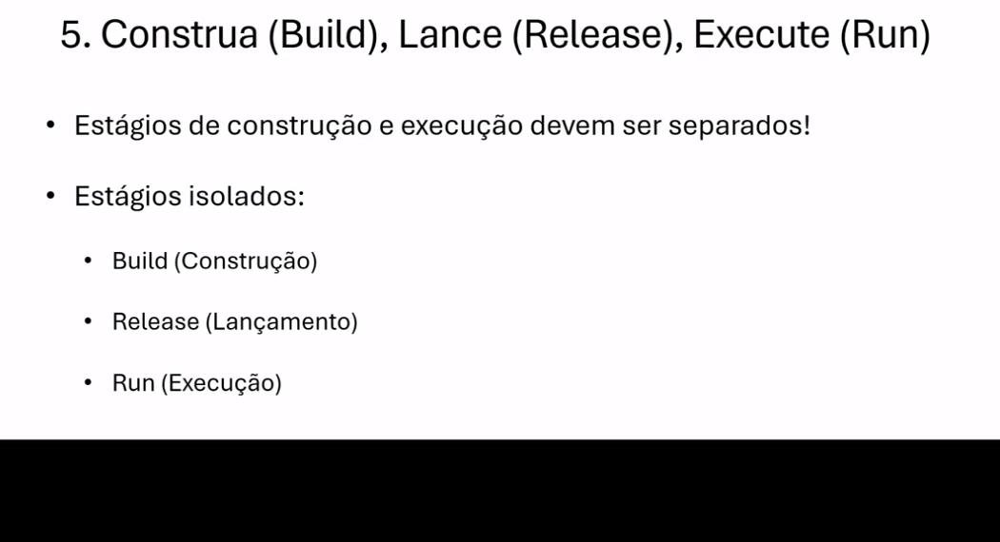

# 12 Factors App

Este módulo aborda os conceitos dos 12 fatores de uma aplicação, que são princípios para construir aplicações modernas e escaláveis. Os 12 fatores são um guia para a construção de aplicações que são fáceis de manter, escaláveis e que seguem as melhores práticas de desenvolvimento de software.

## Fatores e DevOps

Os 12 fatores são um guia para a construção de aplicações modernas e escaláveis. Eles são um conjunto de princípios que ajudam a criar aplicações que são fáceis de manter, escaláveis e que seguem as melhores práticas de desenvolvimento de software. Os 12 fatores são uma parte importante do DevOps, pois ajudam a criar aplicações que são fáceis de implantar e manter.

## Escalabilidade vertical e horizontal

A escalabilidade vertical é a capacidade de aumentar a capacidade de um servidor adicionando mais recursos, como CPU, memória e disco. A escalabilidade horizontal é a capacidade de aumentar a capacidade de um sistema adicionando mais servidores.

## Base de Código

A base de código é a coleção de todos os arquivos e pastas que compõem um projeto de software. É importante manter uma base de código limpa e organizada para facilitar a manutenção e o desenvolvimento de novos recursos.

## Dependências

As dependências são os pacotes de software que uma aplicação precisa para funcionar corretamente. É importante gerenciar as dependências de uma aplicação de forma eficiente para garantir que ela funcione corretamente e seja fácil de manter.

## Serviços de apoio

Os serviços de apoio são os serviços externos que uma aplicação precisa para funcionar corretamente. É importante gerenciar os serviços de apoio de uma aplicação de forma eficiente para garantir que ela funcione corretamente.

## Build, Release and Run

O processo de build, release e run é a base para a implantação contínua de uma aplicação. O processo de build é a transformação do código-fonte em um artefato executável. O processo de release é a implantação do artefato em um ambiente de produção. O processo de run é a execução da aplicação em um ambiente de produção.

## Processos

Os processos são as instâncias de uma aplicação em execução. É importante gerenciar os processos de uma aplicação de forma eficiente para garantir que ela funcione corretamente e seja fácil de manter.

## Vínculo de Porta

O vínculo de porta é o processo de associar uma aplicação a uma porta específica em um servidor. É importante gerenciar o vínculo de porta de uma aplicação de forma eficiente para garantir que ela funcione corretamente.

## Concorrência

A concorrência é a capacidade de uma aplicação de executar várias tarefas simultaneamente. É importante gerenciar a concorrência de uma aplicação de forma eficiente para garantir que ela funcione corretamente.

## Descartabilidade

A descartabilidade é a capacidade de uma aplicação de ser facilmente descartada e substituída. É importante gerenciar a descartabilidade de uma aplicação de forma eficiente para garantir que ela seja fácil de manter.

## Paridade entre desenvolvimento e produção

A paridade entre desenvolvimento e produção é a prática de manter os ambientes de desenvolvimento e produção o mais semelhantes possível. É importante manter a paridade entre desenvolvimento e produção para garantir que uma aplicação funcione corretamente em ambos os ambientes.

## Logs

Os logs são registros de eventos que ocorrem em uma aplicação. É importante gerenciar os logs de uma aplicação de forma eficiente para garantir que ela funcione corretamente e seja fácil de manter.

## Administração de Processos

A administração de processos é a prática de monitorar e gerenciar os processos de uma aplicação. É importante administrar os processos de uma aplicação de forma eficiente para garantir que ela funcione corretamente.

## Certificado de Conclusão do Módulo 3 da trilha DevOps

Este certificado reconhece a conclusão bem-sucedida do segundo módulo do curso de DevOps, comprovando as habilidades e conhecimentos adquiridos na área. É uma validação do compromisso com a excelência em práticas DevOps e aprimoramento contínuo no campo da engenharia de software.

