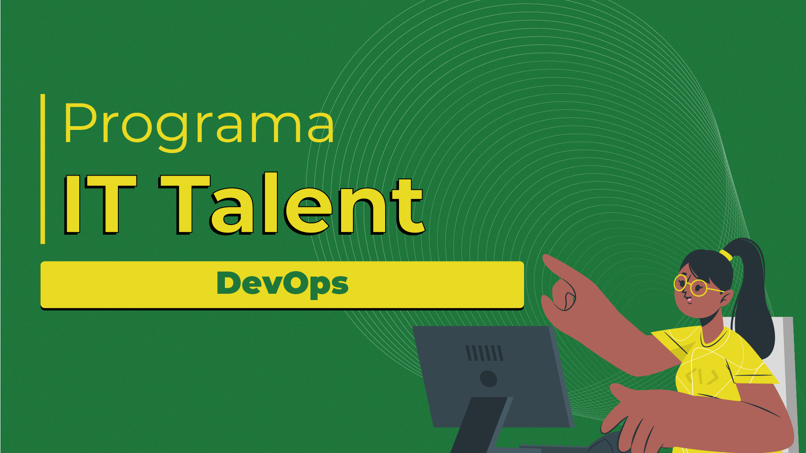

# IT Talent

Bem-vindo ao Programa IT Talent! Esta é uma trilha destinada a completar os conhecimentos em DevOps.

## Pré-requisito

Antes de começar esta trilha, é necessário ter concluído os seguintes cursos:
- Curso de Git
- [Curso de Java](https://github.com/CauanDZN/java-conceitos-iniciais)
- [Curso de Play Framework](https://github.com/CauanDZN/api-com-play)

## Trilha DevOps

Esta trilha consiste em uma série de módulos que abordam diferentes aspectos do DevOps. Abaixo está a lista completa dos módulos:

1. **[Introdução a DevOps](01_introducao_a_devops)**
2. **[Introdução a Redes](02_introducao_a_redes)**
3. **[12 Factors App](03_twelve_factors_app)**
4. **Introdução a Linux, WSL e Shell Scripting**
5. **Conteinerização 1**
6. **Conteinerização 2**
7. **Hackathon 1**
8. **CI/CD 1**
9. **CI/CD 2**
10. **Hackathon 2**
11. **Nuvem 1**
12. **Nuvem 2**
13. **Nuvem 3**
14. **Orquestração 1**
15. **Orquestração 2**
16. **Hackathon 3**
17. **Infra como Código**
18. **Monitoramento e Observabilidade**
19. **Hackathon 4**
20. **Encerramento**

Cada módulo aborda tópicos específicos relacionados ao DevOps, fornecendo uma base sólida de conhecimento para a jornada profissional nesta área.
